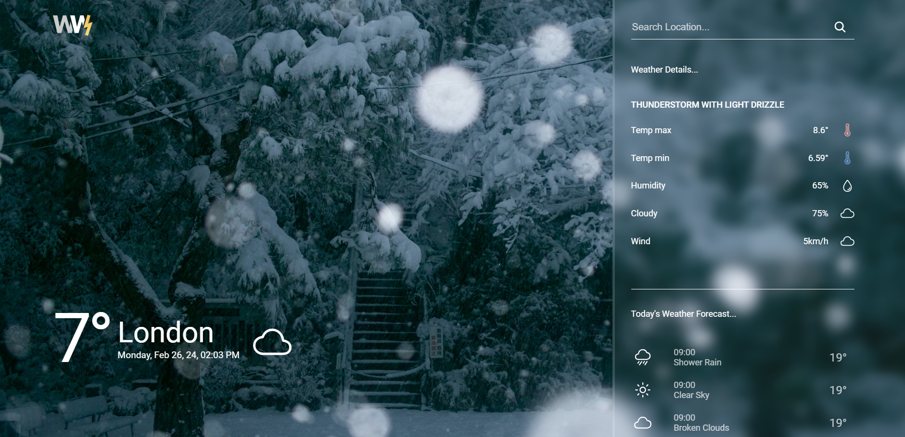

# Weather.io 🌦️

&nbsp;&nbsp;&nbsp;&nbsp;&nbsp;

&nbsp;&nbsp;&nbsp;&nbsp;&nbsp;

&nbsp;&nbsp;&nbsp;&nbsp;&nbsp;

&nbsp;&nbsp;&nbsp;&nbsp;&nbsp;

Welcome to WeatherIo, your go-to weather app for instant updates on the forecast! Whether you're planning your day or just curious about the weather, WeatherIo has you covered.

## Features

- **Real-time Weather Updates:** Get the latest weather information for your location with just a tap.
- **Beautiful Visuals:** Enjoy stunning visuals that reflect the current weather conditions, making your weather experience both informative and delightful.
- **Hourly and Daily Forecasts:** Plan your activities with hourly and daily forecasts, ensuring you're prepared for any weather changes.
- **Location-based Forecast:** Accurate and personalized weather forecasts tailored to your current location.

## How to Use

1. **Install Dependencies:** Run `npm install` to install the necessary dependencies.
2. **Start the App:** Use `npm start` to launch the WeatherNow app locally.
3. **Explore and Enjoy:** Open your browser and navigate to `http://localhost:3000` to start exploring the weather in style!

## Technologies Used

- React ⚛️
- OpenWeatherMap API 🌐
- Sass 🎨
- [React Icons](https://react-icons.github.io/react-icons/) 🚀

## Contribution

WeatherIo is an open-source project, and contributions are welcome! If you have ideas for improvements or new features, feel free to fork the repository and submit a pull request.

## Credits

- Weather data provided by [OpenWeatherMap](https://openweathermap.org/)
- Icons by [React Icons](https://react-icons.github.io/react-icons/)
